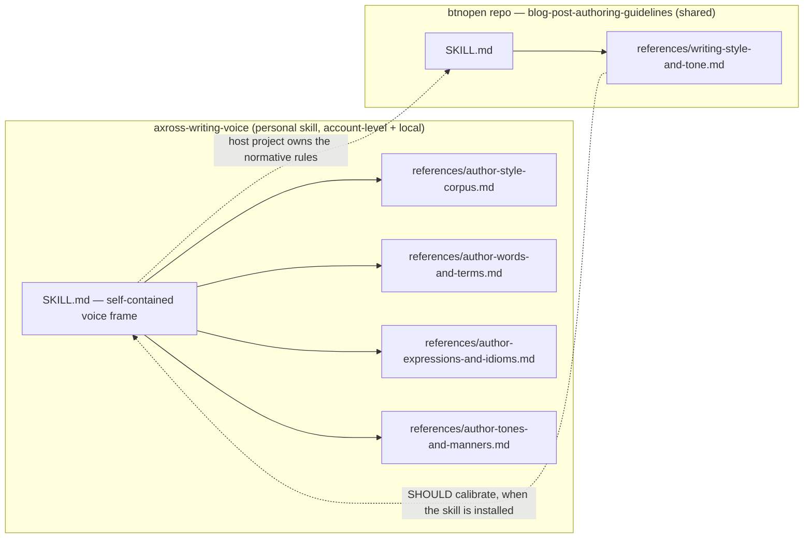

# Plan: Extract the author's writing voice into a personal, cloud-available skill

## Summary

The four author-voice reference files under `blog-post-authoring-guidelines` — `author-style-corpus.md`, `author-words-and-terms.md`, `author-expressions-and-idioms.md`, and `author-tones-and-manners.md` — encode a measured stylometric fingerprint of the site author (axross), derived from the author's own public posts. They are personal to the author, reusable beyond this repository, and unnecessary for other contributors, yet they currently live inside a shared project skill and are hard-wired into it by ~14 cross-links. This plan lifts those four files into a single **personal** Claude Code skill named `axross-writing-voice`, hosts it so it loads in **both** cloud/web and local sessions, and rewires the project's `blog-post-authoring-guidelines` skill so it treats the personal skill as an **optional** calibration dependency that degrades gracefully when absent — without duplicating any normative rule. No product code, routes, or runtime surface change; this is a skill-tree and documentation restructure.

## Background

- `blog-post-authoring-guidelines` owns btnopen's editorial policy. Its normative rules live in `references/writing-style-and-tone.md`; the four author-voice files are *evidence* that policy calibrates against.
- The four files are one revised-together unit: a corpus refresh re-reads `author-style-corpus.md` and re-measures the three distilled files (`author-words-and-terms.md:5`).
- The project's own authoring doctrine already anticipates this move. `agent-skills-best-practices/references/cross-referencing.md` states a skill must be "liftable to a user-, organization-, or global-level skill root without dragging its siblings along," that cross-skill references MUST be name-based (never path-based), that links into another skill's `references/` are forbidden, and that no rule wording may be duplicated across skills.
- Claude Code reads personal skills from `~/.claude/skills/` **only in local-CLI sessions**; cloud, web (claude.ai/code), Cowork, and Routine sessions do **not** read that directory. The mechanism that *does* reach cloud sessions is **account-level Skills** enabled in claude.ai Settings, which are loaded into cloud sessions automatically and support a `SKILL.md` + `references/` layout.
- Coupling audit (grep across the tree, including dot-dirs): the four files are referenced **only** through Markdown links inside `blog-post-authoring-guidelines`. No code, CI, test, `AGENTS.md` routing row, or `REVIEW.md` entry consumes them.



### Goals

- Move the four author-voice files out of the shared repo into one personal skill, `axross-writing-voice`, that the author can reuse across projects.
- Make that skill available in **both** cloud/web and local Claude Code sessions.
- Keep the project's authoring guidance correct and self-sufficient when the personal skill is absent (CI, a fresh clone, a session where the account skill is not enabled).
- Preserve doctrine: name-based cross-skill references, intra-skill relative links, single source of truth for every rule.

### Non-goals

- Removing the author's data from git history. A working-tree move leaves every prior commit intact; genuine history removal needs a rewrite (`git filter-repo`/BFG + force-push) that this project's GitHub guidelines forbid without explicit human approval and that cannot recall existing clones. Omitted deliberately; see Open questions.
- Moving `writing-style-and-tone.md` or any other `blog-post-authoring-guidelines` reference. Those are btnopen editorial policy and stay in-repo; the dependency direction (policy consumes voice evidence) is correct.
- Changing the `/author` workflow's steps. It orchestrates `blog-post-authoring-guidelines` by name and needs no edit.
- Any product-code, route, migration, or runtime change.

### Assumptions

- The author is effectively the sole writer of btnopen; a soft, optional dependency on a personal skill is acceptable for this repo.
- The author has a claude.ai account under which the account-level Skill will be enabled, and uses that same account for cloud/web Claude Code.
- The goal is **portability and de-aggregation** (stop coupling a consolidated stylometric-identity profile to the shared repo; enable reuse elsewhere), not secrecy of already-public data.

## Functional requirements

- When an agent drafts, rewrites, or reviews prose meant to sound like the author, and the personal skill is available, it SHOULD calibrate word choice, phrasing, tone, and sentence-ending register against the measured evidence.
- When the personal skill is **absent**, the project's authoring guidance MUST remain internally consistent and self-sufficient: no rule may demand a file that is not present, and the retained in-repo cues (`僕`, `めちゃくちゃ`, the `です/ます` register) MUST be enough to author acceptably.
- The personal skill MUST be usable outside btnopen: its `SKILL.md` carries a self-contained voice frame, and its files do not hard-assume the btnopen project.
- Discovery metadata (name/description) for the personal skill MUST let an agent decide to consult it from the description alone.

### UI design

Omitted: no user-facing view changes.

### System design

The change has two halves — an **external** personal skill (not committed to this repo) and an **in-repo** rewrite of the citing skill — plus a **hosting** decision that answers "how do we make it cloud-available."

#### Half 1 — the personal skill `axross-writing-voice`

Directory layout (identical whether hosted as an account-level Skill or under `~/.claude/skills/`):

```
axross-writing-voice/
├── SKILL.md                                  (NEW front door)
└── references/
    ├── author-style-corpus.md                (moved)
    ├── author-words-and-terms.md             (moved)
    ├── author-expressions-and-idioms.md      (moved)
    └── author-tones-and-manners.md           (moved)
```

- **Name:** `axross-writing-voice` (`user-invocable: false`). The identity-anchored handle disambiguates "author of what?" once the skill is used outside btnopen — a legitimate exception to the avoid-actor-names rule because the asset *is* identity-anchored. Reference files keep their `author-*.md` names (renaming would be pure churn; the links are self-referential inside the skill).
- **The four files move together**, so their links to each other stay relative and keep resolving. Do **not** split the corpus from the three distilled files: they are refreshed as a unit, and splitting would turn intra-skill evidence links into forbidden cross-skill deep-links.
- **New `SKILL.md` frame** (self-contained, non-duplicative — it must NOT restate `writing-style-and-tone.md`'s detailed rules):

  > These references measure the personal writing voice of the author (axross). When writing, rewriting, or reviewing prose meant to sound like the author, prefer the measured choices recorded here over generic alternatives, avoid the anti-lexicon, and keep one register consistent from title to close. This skill supplies voice *evidence*, not project policy: when used inside a project, that project's own editorial guidelines own the normative MUST/SHOULD requirements (register defaults, locale, metadata), and this evidence calibrates against them.

  Frontmatter `description` MUST be ≤200 characters (account-level Skills cap it there); fold the "when to use" into the description rather than relying on `when_to_use` (its support in account-level Skills is unconfirmed). Draft:

  > `description: Measured personal writing voice of axross — lexicon/anti-lexicon, expression and tone patterns, and source corpus — for writing or reviewing prose that should sound like the author.`

- **De-btnopen-ify the moved files (SHOULD):** in `author-style-corpus.md`, generalize project-bound framing (`:3` "drafting or refining btnopen blog posts" → "the author's posts"; `:59` "the btnopen default" → neutral evidence phrasing) so the reused skill is not hardcoded to this project.

#### Half 2 — rewrite the in-repo citing skill

The move breaks every link unless rewritten to doctrine. The exact edit set is in [Appendix A](#appendix-a--exact-edit-set). Three principles:

1. **Every project→personal reference becomes an optional, install-gated `SHOULD`/`MAY`** that (a) marks the target external/not-in-repo, (b) names the in-repo fallback, and (c) states what is lost when absent. Three current `MUST` rules (`writing-style-and-tone.md:79`, `editorial-workflow.md:36`, and `:50`) hard-require the moved corpus; left as `MUST`, a CI/clone/cloud agent honoring them hits an unsatisfiable instruction — a `REVIEW.md` merge blocker. They downgrade to `SHOULD … when installed`.
2. **Inbound links point at one new in-repo section, not at the external skill.** Collapse the four `SKILL.md` routing sections into a single `## Author Voice Evidence (optional, external)` note; every inbound site links to *that* note by relative path (so `check-links.sh` still sees it). The note documents why the skill has **no** `AGENTS.md` index row (unresolvable for CI/contributors) so a future audit does not "repair" it.
3. **Personal→project back-references name the owning skill + topic** (`blog-post-authoring-guidelines`, writing-style-and-tone topic), never a `references/` path, and degrade to "follow the host project's editorial guidelines" outside btnopen.

#### Hosting — how to make it user-global AND cloud-available

| | **Option A — Account-level Skill (recommended)** | **Option B — Personal skills repo + SessionStart hook** |
| --- | --- | --- |
| Setup | Zip the `axross-writing-voice/` folder; upload in **claude.ai → Settings → Capabilities**; enable the toggle. | Push the folder to a **private** git repo; commit a `SessionStart` hook to btnopen's `.claude/settings.json` that clones/pulls it into `~/.claude/skills/` and returns `reloadSkills: true`. |
| Cloud / web sessions | ✅ Loaded automatically | ✅ Hook runs in the cloud VM |
| Local CLI | ❓ Unconfirmed — mitigate by also copying the same folder into `~/.claude/skills/` locally | ✅ Confirmed |
| Privacy | ✅ Account-private | ⚠️ Hook code + repo URL visible in the shared repo; per-project |
| `references/` layout | ✅ Supported | ✅ Supported |
| Upkeep | Edit via the Settings UI (re-upload) | Edit the skills repo, push; every session pulls latest |

**Recommendation:** Option A is the direct "user-global skill in Claude that works in the cloud" feature and is account-private. Because the source is a single folder, cover the local-CLI uncertainty by *also* copying that folder to `~/.claude/skills/axross-writing-voice/` — one source of truth, both surfaces. Use Option B instead only if you want one mechanism with confirmed local+cloud coverage and accept the hook living in the repo. Note that **the in-repo Half 2 rewrite is identical regardless of hosting**, because the project must degrade gracefully in any session where the skill is not enabled (CI, teammates, a not-yet-enabled account).

#### Alternatives considered

- **Move only the corpus, keep the distilled files in-repo.** Rejected: it strands half the fingerprint in the shared repo (defeating de-aggregation) and severs the refresh unit; only wins if secrecy were achievable, which it is not.
- **Split into two personal skills (raw corpus vs distilled rules).** Rejected: MECE consolidation signal — two skills trigger on identical prompts with heavy cross-refs — and it converts intra-skill links into forbidden cross-skill deep-links.
- **Keep everything in-repo as a standalone project skill.** Viable and simplest; it preserves full-fidelity loading everywhere including CI. Rejected against the stated goal because it is neither personal, private, nor reusable across the author's other projects. (If cross-surface fidelity outweighs portability, this is the fallback.)
- **Pure `~/.claude/skills/` only.** Rejected: invisible to every cloud/web/Routine session, i.e. exactly where `/author` may run.

## Non-functional requirements

- **Graceful degradation:** in a session without the personal skill, `blog-post-authoring-guidelines` contains **zero** rules that require an absent file; every downgraded reference names a self-sufficient in-repo fallback.
- **No rule duplication:** the `です/ます` polite-form default is single-owned by `writing-style-and-tone.md:43`; `author-style-corpus.md:59` is softened to evidence, not a restated default.
- **Link integrity:** `check-links.sh` reports 0 broken relative links at the repo root after the rewrite, and 0 within the personal skill folder.
- **Discovery cap:** the personal skill's `description` is ≤200 characters.
- **Doctrine conformance:** no path-link into another skill; no `references/` deep-link across skills; no new `AGENTS.md` row for the external skill.

## Acceptance criteria

- The four files no longer exist under `.claude/skills/blog-post-authoring-guidelines/references/`, and exist under `axross-writing-voice/references/` with their inter-file relative links intact.
- `axross-writing-voice/SKILL.md` exists with `name: axross-writing-voice`, `user-invocable: false`, a ≤200-char description, and the self-contained voice frame; it does not restate `writing-style-and-tone.md`'s rules.
- `blog-post-authoring-guidelines/SKILL.md` has one `## Author Voice Evidence (optional, external)` note in place of the four former routing sections, and that note explains the deliberate absence of an `AGENTS.md` row.
- No file under `blog-post-authoring-guidelines/` contains a relative link to any of the four moved basenames.
- `writing-style-and-tone.md:79`, `editorial-workflow.md:36`, and `editorial-workflow.md:50` read as `SHOULD … when installed` with an in-repo fallback; `metadata-and-taxonomy.md:29` keeps its register `MUST` with a softened, install-gated citation.
- The four files' former "Normative style rules stay in writing-style-and-tone.md" back-references name `blog-post-authoring-guidelines` (owning skill + topic) and carry an outside-btnopen degradation clause; none names a `references/` path.
- `AGENTS.md` has no row for `axross-writing-voice`.
- `check-links.sh` passes at the repo root; `npm run format` and `npm run lint` pass.
- The skill loads in a cloud/web session (appears in the skill listing) once hosted per the chosen option.

## Verification strategy

1. Run `.claude/skills/agent-skills-best-practices/scripts/check-links.sh` from the repo root. Expect 0 broken after the rewrite. (Run it once *before* the inbound rewrites too: it should flag every inbound staying→moved link, confirming the inbound set is fully enumerated.)
2. Run the same checker against the personal skill folder to confirm the four files' relative links resolve at the new home.
3. `grep -rn 'author-style-corpus\|author-words-and-terms\|author-expressions-and-idioms\|author-tones-and-manners' .claude/skills/blog-post-authoring-guidelines` → expect 0 relative-link hits.
4. Manually confirm each downgraded reference reads `SHOULD … when installed` with a named in-repo fallback, and that no `MUST` in the staying skill requires the absent asset.
5. Manually confirm the back-references in the moved files name the owning skill + topic (not a path) and degrade outside btnopen.
6. Run `npm run format` and `npm run lint`. No `build`, `test:unit`, or `test:e2e` — no code, route, config, or runtime surface changes (stated per the project's verification rules).
7. After hosting: open a cloud/web Claude Code session and confirm `axross-writing-voice` appears in the skill listing; in a local CLI session, confirm the same (via the `~/.claude/skills/` copy if Option A's local coverage is absent).

## Open questions

- **Account-level Skills in the local CLI:** unconfirmed whether skills enabled in claude.ai Settings also load in the local Claude Code CLI. Mitigation in the plan: also copy the folder to `~/.claude/skills/`. Worth a quick test before deciding whether the local copy is needed.
- **Repository visibility:** is `axross/btnopen.com` public or private? It affects how much the "de-aggregation" rationale matters, though not the plan's mechanics.
- **Git history:** the four files remain in past commits after the move; if their historical presence in the repo matters, a separate, explicitly-approved history rewrite is required. Recommended default: accept history as-is (the data is already public at `medium.com/@axross`).
- **Hosting choice:** Option A (recommended) vs Option B — a decision for the author based on the local-CLI test result and tolerance for a hook in the repo.
- **This plan document's fate:** it is a transient working artifact; delete it after execution, or keep it as an ADR — author's choice.

---

## Appendix A — exact edit set

### A.1 In-repo, `blog-post-authoring-guidelines/`

**`SKILL.md`** — replace the four routing sections (`## Author Style Corpus`, `## Author Words And Terms`, `## Author Expressions And Idioms`, `## Author Tones And Manners`, current lines ~32–61) with one section:

```markdown
## Author Voice Evidence (optional, external)

The measured evidence for the author's writing voice — the lexicon and
anti-lexicon, expression and idiom templates, the tone gradient, and the source
corpus with its sentence-ending statistics and article shapes — lives in a
personal skill (`axross-writing-voice`), not in this repository. It is an
OPTIONAL dependency, intentionally absent from this project's master skill index
because it cannot be resolved by contributors, CI, or a fresh clone; do not
"repair" that omission by adding an index row.

SHOULD consult `axross-writing-voice` to calibrate word choice, phrasing, tone,
and sentence-ending register against measured author evidence when it is
installed. When it is absent — CI, a fresh clone, or a session where the skill
is not enabled — the normative rules and example tokens in
[writing-style-and-tone.md](./references/writing-style-and-tone.md) are
self-sufficient; apply them and note in the summary that voice-evidence
calibration was unavailable. Do not fabricate the measured counts or the corpus.
```

**`references/writing-style-and-tone.md`**

- `:79` (downgrade the `MUST`):
  ```text
  SHOULD compare broad rewrites against the author's measured sentence-ending profile when the optional author-voice evidence is installed (see the Author Voice Evidence note in [SKILL.md](../SKILL.md)); when it is absent, the `です/ます` default and the plain-form reservations in this file are sufficient — apply them and flag that measured calibration was skipped.
  ```
- `:17` (three links → one install-gated pointer; keep the illustrative tokens):
  ```text
  SHOULD calibrate word choice (including the anti-lexicon), phrasing, and tone against the author's measured voice evidence when the optional `axross-writing-voice` skill is installed (see the Author Voice Evidence note in [SKILL.md](../SKILL.md)); when it is absent, the cues named in this file — `僕`, `めちゃくちゃ`, and the `です/ます` register — stand on their own.
  ```
- `:7` and `:45` (corpus links) → re-point to the same note with the same install-gated phrasing.
- Prose sweep (`:21`, `:31`, `:96` and similar): "the corpus" → "the author-voice evidence (when available)". Keep the `僕`/`めちゃくちゃ` example tokens (they are the fallback summary).

**`references/editorial-workflow.md`**

- `:36` (downgrade the `MUST`):
  ```text
  SHOULD consult the author-voice evidence (the optional `axross-writing-voice` skill; see the Author Voice Evidence note in [SKILL.md](../SKILL.md)) when the rewrite changes voice, sentence endings, article structure, or personal framing and it is installed; when it is absent, rely on the register and structure rules in [writing-style-and-tone.md](./writing-style-and-tone.md) and note that measured calibration was skipped.
  ```
- `:50` (SHOULD sample against corpus) → re-point to the note, install-gated.

**`references/metadata-and-taxonomy.md`**

- `:29` (keep the register `MUST`, soften the citation):
  ```text
  MUST match the title's register to the body's register: polite announcements for audience-facing milestones (「〜をリリースしました」), plain form only for diary-register life logs (「〜に着いた」). When the optional author-voice evidence is installed, calibrate the title register against its measured title evidence (see the Author Voice Evidence note in [SKILL.md](../SKILL.md)).
  ```

**`references/post-structure.md`**

- `:108` (two links — first stays relative, second converts):
  ```text
  SHOULD follow [writing-style-and-tone.md](./writing-style-and-tone.md) for the dated `追記` addendum rule and the diary-register exception when this archetype needs them; the register evidence lives in the optional author-voice skill (see the Author Voice Evidence note in [SKILL.md](../SKILL.md)) when installed.
  ```

### A.2 Moved files, `axross-writing-voice/references/`

**`author-words-and-terms.md:5`, `author-expressions-and-idioms.md:5`, `author-tones-and-manners.md:5`** — replace the current sentence `Normative style rules stay in [writing-style-and-tone.md](./writing-style-and-tone.md).` with:
  > This file records measured evidence, not rules. When you are writing for the btnopen project, the normative editorial rules it calibrates are owned by that project's `blog-post-authoring-guidelines` skill (its writing-style-and-tone topic); apply those rules there. In any other project, treat this file as a self-contained description of the author's voice and follow the host project's own editorial guidelines for normative requirements.

**`author-style-corpus.md:75`** (mid-rule — hand-edit):
  > The normative rules for when the diary register is allowed are owned by the host project's editorial guidelines — in the btnopen project, its `blog-post-authoring-guidelines` skill (writing-style-and-tone topic); this profile records only the evidence.

**`author-style-corpus.md`** de-btnopen-ify + de-duplicate: generalize `:3` and `:59` framing; soften `:59`'s polite-form assertion to evidence ("measured ≈95% polite in audience-facing posts"), leaving the `です/ます` **default** owned solely by `writing-style-and-tone.md:43`.

Inter-file links among the four (`:3` of each, `author-expressions-and-idioms.md:28`) stay relative — they move together.

### A.3 Hosting artifacts (only if Option B)

`.claude/settings.json` gains a `SessionStart` (`matcher: "startup|resume"`) hook that clones/pulls the private skills repo into `~/.claude/skills/` and emits `{"hookSpecificOutput": {"reloadSkills": true}}`. Keep the clone/pull fast (it runs every session start). Not needed for Option A.
